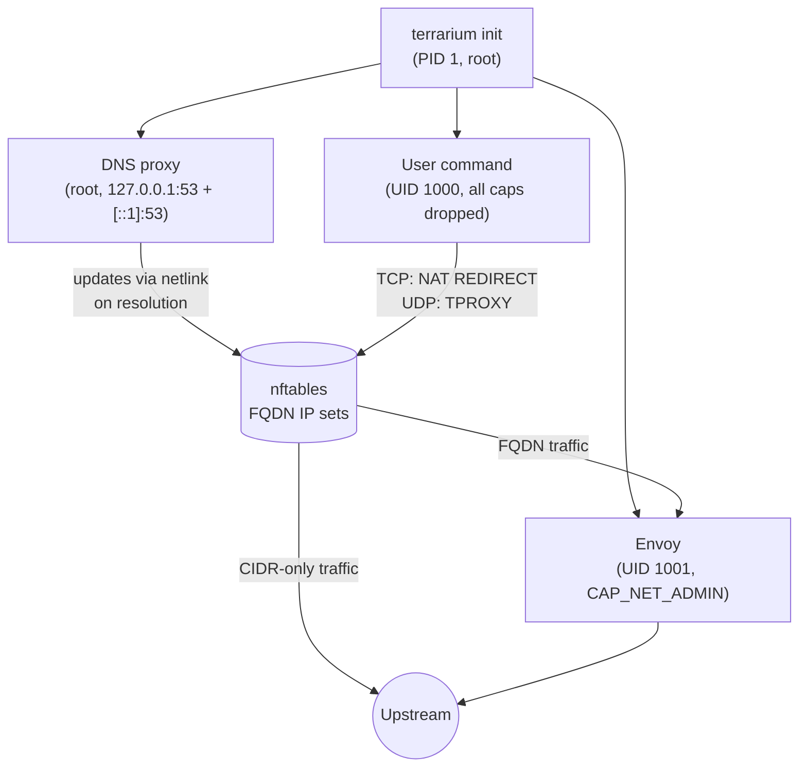
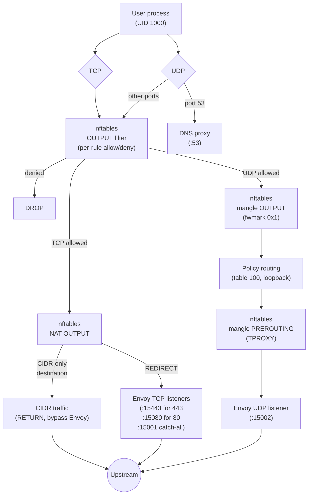

<p align="center">
  <h1 align="center">Terrarium</h1>
</p>

<p align="center">
  <a href="https://pkg.go.dev/go.jacobcolvin.com/terrarium"></a>
  <a href="https://goreportcard.com/report/go.jacobcolvin.com/terrarium"></a>
  <a href="https://codecov.io/gh/macropower/terrarium"></a>
  <a href="#installation"></a>
  <a href="https://github.com/macropower/terrarium/blob/main/LICENSE"></a>
</p>

Terrarium is a secure container environment that uses [Envoy](https://www.envoyproxy.io/) as an L7 egress gateway,
configured via familiar [Cilium](https://cilium.io/) network policy semantics.

> See [CiliumNetworkPolicy Compatibility](docs/cnp-compatibility.md).

Terrarium allows you to declare policies that balance security and functionality,
based on your risk tolerance, environment, and use cases.

It is particularly useful for running fully autonomous AI agents.

## Usage

Published images include the terrarium binary and Envoy but not
language runtimes, package managers, or other tools your workload
needs. Use the image as a base layer or copy the binary into your own
image.

### Use as a base image

The `:alpine` and `:debian` variants ship with ca-certificates and
Envoy pre-installed:

```dockerfile
FROM ghcr.io/macropower/terrarium:alpine
RUN apk add --no-cache python3
COPY config.yaml /home/dev/.config/terrarium/config.yaml
ENTRYPOINT ["terrarium", "init", "--"]
CMD ["python3", "app.py"]
```

### Copy the binary into your own image

The `:latest` (scratch) variant contains only the terrarium binary,
which makes it useful as a copy source in a multi-stage build:

```dockerfile
FROM ghcr.io/macropower/terrarium:latest AS terrarium

FROM ubuntu:24.04
RUN apt-get update && apt-get install -y --no-install-recommends \
      ca-certificates envoy && \
    rm -rf /var/lib/apt/lists/*
COPY --from=terrarium /usr/local/bin/terrarium /usr/local/bin/terrarium
COPY config.yaml /home/dev/.config/terrarium/config.yaml
ENTRYPOINT ["terrarium", "init", "--"]
CMD ["/bin/bash"]
```

### Running

However you build your image, `terrarium init` is the main entry point.
It sets up the firewall, DNS proxy, and Envoy, then drops privileges and
execs your command:

```sh
docker run --cap-add=NET_ADMIN my-terrarium-image
```

`--cap-add=NET_ADMIN` is required for nftables. The default config path is `~/.config/terrarium/config.yaml` (following XDG conventions); override it with `--config`. Use `--ready-file` to create a file once all infrastructure is up, useful for orchestration. See `terrarium init --help` for the full flag reference.

## Examples

Allow GET requests to repos in your GitHub organization, injecting an API key header:

```yaml
egress:
  - toFQDNs:
      - matchName: "github.com"
      - matchPattern: "*.github.com"
    toPorts:
      - ports:
          - port: "443"
            protocol: TCP
        rules:
          http:
            - method: "GET"
              path: "/my-org/.*"
              headerMatches:
                - name: "Authorization"
                  mismatch: ADD
                  value: "Bearer ghp_xxxxxxxxxxxx"
```

Allow DNS resolution for internal domains, plus HTTPS access:

```yaml
egress:
  - toFQDNs:
      - matchName: "internal.example.com"
      - matchPattern: "*.internal.example.com"
    toPorts:
      - ports:
          - port: "53"
            protocol: UDP
          - port: "53"
            protocol: TCP
        rules:
          dns:
            - matchName: "internal.example.com"
            - matchPattern: "*.internal.example.com"
      - ports:
          - port: "443"
            protocol: TCP
```

Allow TLS connections to specific SNIs within a CIDR range:

```yaml
egress:
  - toCIDR:
      - "10.0.0.0/8"
    toPorts:
      - ports:
          - port: "443"
            protocol: TCP
        serverNames:
          - "db.internal.example.com"
          - "*.internal.example.com"
```

Allow access to the internet, deny access to your internal network:

```yaml
egress:
  - toCIDRSet:
      - cidr: "0.0.0.0/0"
        except:
          - "10.0.0.0/8"
          - "172.16.0.0/12"
          - "192.168.0.0/16"
```

Block specific ports to private subnets:

```yaml
egressDeny:
  - toCIDR:
      - "192.168.0.0/16"
    toPorts:
      - ports:
          - port: "22"
            protocol: TCP
  - toCIDRSet:
      - cidr: "172.16.0.0/12"
        except:
          - "172.16.1.0/24"
    toPorts:
      - ports:
          - port: "3306"
            protocol: TCP
```

Forward non-TLS TCP services (like SSH) through Envoy to a named host:

```yaml
tcpForwards:
  - port: 22
    host: "github.com"
```

## Design

### Process model

All processes share the same network namespace. Communication happens through
kernel data structures (nftables sets via netlink) and loopback sockets.



### Single-container architecture

Terrarium runs all components (firewall, DNS proxy, Envoy, user process) inside a
single container sharing one network namespace. This isn't a packaging convenience;
it's how the security model works.

nftables rules dispatch traffic based on process UID: the terrarium user (1000) gets
full rule enforcement, Envoy (1001) gets unrestricted egress (domain allowlisting is
enforced in Envoy's own config), and root (0) gets DNS access. Splitting into
separate containers gives each its own network namespace, which breaks UID-based
filtering entirely. You could share network namespaces across containers
(a la Kubernetes Pods), but that adds orchestration complexity to arrive back at the
same topology.

The components also depend on each other at runtime. The DNS proxy resolves allowed
FQDNs and updates nftables IP sets via netlink. nftables redirects user traffic to
Envoy's loopback listeners. The init process (PID 1) manages the lifecycle of all
processes, forwards signals, and reaps zombies. Privilege drop happens atomically
before exec'ing the user command.

There's also no real upside to splitting. Every component is 1:1 with the user
workload, so independent scaling doesn't apply. The Envoy config and nftables rules
are generated together from the same policy and can't drift independently, so
independent upgrades don't work either. And fault isolation is actively undesirable
here: if the DNS proxy or firewall crashes, the user process should stop. A security
boundary with a hole is worse than no service at all.

### User process isolation

The user command (UID 1000) shares a network namespace with the firewall, DNS
proxy, and Envoy. Several kernel mechanisms prevent it from tampering with those
components.

#### Capabilities

`terrarium exec` launches the user command with `--inh-caps=-all` and
`--bounding-set=-all`, which clears the entire Linux capability bounding set.
This is the foundational constraint; everything else is defense in depth.

Without capabilities, the user process cannot:

- Modify nftables rules or IP sets (`CAP_NET_ADMIN`).
- Bind to port 53 to replace the DNS proxy (`CAP_NET_BIND_SERVICE`).
- Send signals to Envoy (UID 1001) or init/DNS proxy (UID 0) (`CAP_KILL`).
- Change its own UID/GID or manipulate process credentials (`CAP_SETUID`,
  `CAP_SETGID`).

#### no-new-privs

The user process runs with `--no-new-privs`. The kernel enforces this across
`execve`: setuid/setgid bits are ignored and no capability can be raised, even
if a suid-root binary exists in the container image.

Envoy does not run with `--no-new-privs` because it needs `CAP_NET_ADMIN` as an
ambient capability. TPROXY requires `IP_TRANSPARENT` on the UDP listener socket,
and only `CAP_NET_ADMIN` can grant that. This is scoped: Envoy still runs as a
dedicated non-root user (UID 1001) with no other elevated capabilities.

#### File ownership

All configuration and certificate files are created by root before the privilege
drop. Envoy config is written 0644 (root-owned, world-readable); TLS certs and
private keys are also 0644 (Envoy needs read access at UID 1001). The user
process can read these files but cannot modify them.

#### Network-level enforcement

Even if the user rewrites `/etc/resolv.conf` to point at an external DNS server,
nftables blocks the attempt. Port 53 egress is only allowed for root (UID 0);
UID 1000 traffic to external port 53 hits the terrarium_output chain's DROP. The
user's DNS queries reach 127.0.0.1:53 (the proxy) via loopback, which is
accepted before UID dispatch.

#### Layered defense

No single mechanism is load-bearing. Capability clearing prevents privilege
escalation, no-new-privs blocks setuid exploitation, UID-based nftables rules
enforce network policy regardless of process behavior, and file permissions
prevent configuration tampering. Bypassing the security model requires
compromising multiple independent kernel subsystems simultaneously.

### Security modes

The firewall, DNS proxy, and Envoy all derive their behavior from the same parsed
policy. Three modes:

- Unrestricted (nil egress): all traffic allowed, routed through Envoy for
  access logging via NAT REDIRECT (TCP) and TPROXY (UDP).
- Blocked (`egress: [{}]`): all traffic denied, DNS returns REFUSED, no Envoy.
- Filtered (rules with FQDN/CIDR/L7 matchers): per-rule chain isolation with
  OR semantics, FQDN IP sets with per-element TTLs, Envoy MITM for L7 inspection.
  CIDR-destined traffic bypasses Envoy; FQDN traffic is intercepted. UDP uses
  TPROXY alongside TCP NAT REDIRECT.

### Traffic routing

In non-blocked modes, all terrarium traffic passes through Envoy for access logging
and policy enforcement. TCP and UDP use different interception mechanisms because
of how the kernel recovers original destination addresses.



#### TCP (NAT REDIRECT)

nftables NAT output rules REDIRECT all terrarium-UID TCP to Envoy. Specialized
listeners handle ports 443 (TLS passthrough, port 15443) and 80 (HTTP forward,
port 15080). Per-rule port restrictions get dedicated listeners at ProxyPortBase
(15000) + port. Everything else hits a catch-all TCP proxy on port 15001. Envoy
uses the `original_dst` listener filter to recover the real destination from
conntrack (SO_ORIGINAL_DST). In filtered mode, CIDR-destined traffic RETURNs
before the catch-all redirect, bypassing Envoy entirely.

#### UDP (TPROXY)

UDP cannot use NAT REDIRECT because SO_ORIGINAL_DST only works for TCP. Instead,
nftables mangle chains and Linux policy routing implement TPROXY:

1. A mangle output chain marks all terrarium-UID UDP packets (excluding port 53)
   with fwmark 0x1.
2. A policy routing rule directs marked packets to table 100, which has a local
   default route through loopback.
3. The packet re-enters via loopback and hits a mangle prerouting chain that
   applies TPROXY, delivering it to Envoy's UDP listener on port 15002.
4. Envoy binds a transparent socket (IP_TRANSPARENT) at 0.0.0.0:15002, recovering
   the original destination from the socket address itself.

Port 53 is excluded from TPROXY marking so DNS queries reach the DNS proxy
directly on loopback. Loose reverse-path filtering (rp_filter=2) is required on
loopback because TPROXY'd packets arrive with non-local source addresses. The
`firewall` package sets `net.ipv4.conf.lo.rp_filter` and
`net.ipv4.conf.all.rp_filter` to 2 during policy routing setup, since the
effective value is `max(conf.all, conf.<iface>)` and both must be loose.

### IPv6

The entire stack is dual-stack. nftables uses a single inet-family table that
covers both IPv4 and IPv6 (replacing four legacy iptables tables). FQDN IP sets
are created in pairs: one `TypeIPAddr` set for A records and one `TypeIP6Addr`
set for AAAA records, both with per-element TTLs. The mangle prerouting chain
has separate per-AF TPROXY rules for `NFPROTO_IPV4` and `NFPROTO_IPV6`. Policy
routing rules and routes are installed for both `AF_INET` and `AF_INET6`. The
DNS proxy listens on both `127.0.0.1:53` and `[::1]:53`, and `/etc/resolv.conf`
is rewritten with both nameservers.

At startup, init checks whether IPv6 is actually available via
`net.ipv6.conf.all.disable_ipv6`. If the stack appears disabled, IPv6 is
explicitly turned off via sysctl on all interfaces as defense-in-depth. The
`ipv6Disabled` flag is threaded through to the DNS proxy so it skips binding
`[::1]`.

### Lifecycle

1. Capture upstream DNS from `/etc/resolv.conf`
2. Generate configs (firewall, Envoy, certs) if not pre-baked
3. Install CA certificates (if L7 rules need MITM)
4. Apply nftables rules atomically via netlink
5. Set up policy routing for UDP TPROXY (if egress is not blocked)
6. Start DNS proxy, rewrite `/etc/resolv.conf` to loopback
7. Start Envoy (if egress is not blocked), wait for listener readiness
8. Create ready-file if configured (signals all infrastructure is up)
9. Drop privileges, exec user command
10. Forward signals to user command, reap zombies
11. On exit: drain Envoy, stop DNS proxy, remove policy routes, flush nftables
