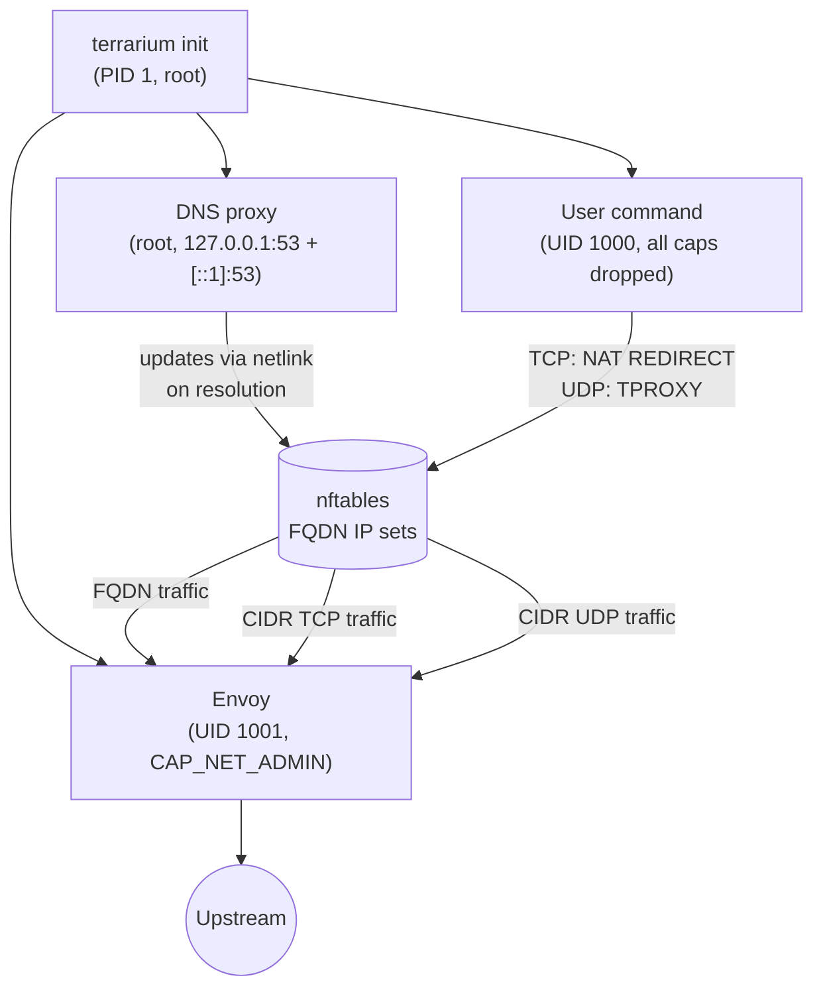
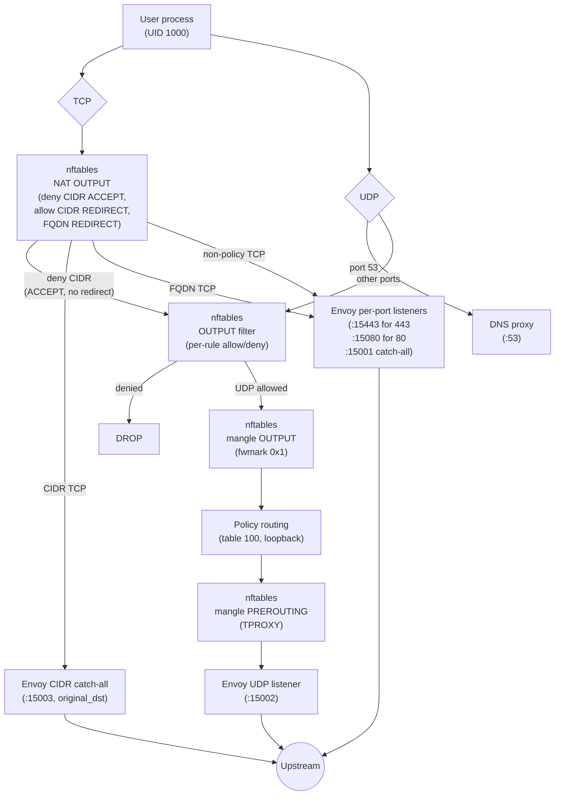

<p align="center">
  <h1 align="center">Terrarium</h1>
</p>

<p align="center">
  <a href="https://pkg.go.dev/go.jacobcolvin.com/terrarium"></a>
  <a href="https://goreportcard.com/report/go.jacobcolvin.com/terrarium"></a>
  <a href="https://codecov.io/gh/macropower/terrarium"></a>
  <a href="#installation"></a>
  <a href="https://github.com/macropower/terrarium/blob/main/LICENSE"></a>
</p>

Terrarium is a secure container environment that uses [Envoy](https://www.envoyproxy.io/) as an L7 egress gateway,
configured via familiar [Cilium](https://cilium.io/) network policy semantics.

> See [CiliumNetworkPolicy Compatibility](docs/cnp-compatibility.md).

Terrarium allows you to declare policies that balance security and functionality,
based on your risk tolerance, environment, and use cases.

It is particularly useful for running fully autonomous AI agents.

## Usage

Published images include the terrarium binary and Envoy but not
language runtimes, package managers, or other tools your workload
needs. Use the image as a base layer or copy the binary into your own
image.

### Use as a base image

The `:debian` variant ships with ca-certificates and Envoy
pre-installed:

```dockerfile
FROM ghcr.io/macropower/terrarium:debian
RUN apt-get update && apt-get install -y python3 && rm -rf /var/lib/apt/lists/*
COPY config.yaml /home/dev/.config/terrarium/config.yaml
ENTRYPOINT ["terrarium", "init", "--"]
CMD ["python3", "app.py"]
```

### Copy the binary into your own image

The `:latest` (scratch) variant contains only the terrarium binary,
which makes it useful as a copy source in a multi-stage build:

```dockerfile
FROM ghcr.io/macropower/terrarium:latest AS terrarium

FROM ubuntu:24.04
RUN apt-get update && apt-get install -y --no-install-recommends \
      ca-certificates envoy && \
    rm -rf /var/lib/apt/lists/*
COPY --from=terrarium /usr/local/bin/terrarium /usr/local/bin/terrarium
COPY config.yaml /home/dev/.config/terrarium/config.yaml
ENTRYPOINT ["terrarium", "init", "--"]
CMD ["/bin/bash"]
```

### Running

However you build your image, `terrarium init` is the main entry point.
It sets up the firewall, DNS proxy, and Envoy, then drops privileges and
execs your command:

```sh
docker run --cap-add=NET_ADMIN my-terrarium-image
```

`--cap-add=NET_ADMIN` is required for nftables. The default config path is `~/.config/terrarium/config.yaml` (following XDG conventions); override it with `--config`. Use `--ready-file` to create a file once all infrastructure is up, useful for orchestration. See `terrarium init --help` for the full flag reference.

## Examples

Allow GET requests to repos in your GitHub organization, injecting an API key header:

```yaml
egress:
  - toFQDNs:
      - matchName: "github.com"
      - matchPattern: "*.github.com"
    toPorts:
      - ports:
          - port: "443"
            protocol: TCP
        rules:
          http:
            - method: "GET"
              path: "/my-org/.*"
              headerMatches:
                - name: "Authorization"
                  mismatch: ADD
                  value: "Bearer ghp_xxxxxxxxxxxx"
```

Allow DNS resolution for internal domains, plus HTTPS access:

```yaml
egress:
  - toFQDNs:
      - matchName: "internal.example.com"
      - matchPattern: "*.internal.example.com"
    toPorts:
      - ports:
          - port: "53"
            protocol: UDP
          - port: "53"
            protocol: TCP
        rules:
          dns:
            - matchName: "internal.example.com"
            - matchPattern: "*.internal.example.com"
      - ports:
          - port: "443"
            protocol: TCP
```

Allow TLS connections to specific SNIs within a CIDR range:

```yaml
egress:
  - toCIDR:
      - "10.0.0.0/8"
    toPorts:
      - ports:
          - port: "443"
            protocol: TCP
        serverNames:
          - "db.internal.example.com"
          - "*.internal.example.com"
```

Allow access to the internet, deny access to your internal network:

```yaml
egress:
  - toCIDRSet:
      - cidr: "0.0.0.0/0"
        except:
          - "10.0.0.0/8"
          - "172.16.0.0/12"
          - "192.168.0.0/16"
```

Block specific ports to private subnets:

```yaml
egressDeny:
  - toCIDR:
      - "192.168.0.0/16"
    toPorts:
      - ports:
          - port: "22"
            protocol: TCP
  - toCIDRSet:
      - cidr: "172.16.0.0/12"
        except:
          - "172.16.1.0/24"
    toPorts:
      - ports:
          - port: "3306"
            protocol: TCP
```

Forward non-TLS TCP services (like SSH) through Envoy to a named host:

```yaml
tcpForwards:
  - port: 22
    host: "github.com"
```

## Design

### Process model

All processes share the same network namespace. Communication happens through
kernel data structures (nftables sets via netlink) and loopback sockets.



### Single-container architecture

Terrarium runs all components (firewall, DNS proxy, Envoy, user process) inside a
single container sharing one network namespace. This isn't a packaging convenience;
it's how the security model works.

nftables rules dispatch traffic based on process UID: the terrarium user (1000) gets
full rule enforcement, Envoy (1001) gets unrestricted egress (domain allowlisting is
enforced in Envoy's own config), and root (0) gets DNS access. Splitting into
separate containers gives each its own network namespace, which breaks UID-based
filtering entirely. You could share network namespaces across containers
(a la Kubernetes Pods), but that adds orchestration complexity to arrive back at the
same topology.

The components also depend on each other at runtime. The DNS proxy resolves allowed
FQDNs and updates nftables IP sets via netlink. nftables redirects user traffic to
Envoy's loopback listeners. The init process (PID 1) manages the lifecycle of all
processes, forwards signals, and reaps zombies. Privilege drop happens atomically
before exec'ing the user command.

There's also no real upside to splitting. Every component is 1:1 with the user
workload, so independent scaling doesn't apply. The Envoy config and nftables rules
are generated together from the same policy and can't drift independently, so
independent upgrades don't work either. And fault isolation is actively undesirable
here: if the DNS proxy or firewall crashes, the user process should stop. A security
boundary with a hole is worse than no service at all.

### User process isolation

The user command (UID 1000) shares a network namespace with the firewall, DNS
proxy, and Envoy. Several kernel mechanisms prevent it from tampering with those
components.

#### Capabilities

`terrarium exec` launches the user command with `--inh-caps=-all` and
`--bounding-set=-all`, which clears the entire Linux capability bounding set.
This is the foundational constraint; everything else is defense in depth.

Without capabilities, the user process cannot:

- Modify nftables rules or IP sets (`CAP_NET_ADMIN`).
- Bind to port 53 to replace the DNS proxy (`CAP_NET_BIND_SERVICE`).
- Send signals to Envoy (UID 1001) or init/DNS proxy (UID 0) (`CAP_KILL`).
- Change its own UID/GID or manipulate process credentials (`CAP_SETUID`,
  `CAP_SETGID`).

#### no-new-privs

The user process runs with `--no-new-privs`. The kernel enforces this across
`execve`: setuid/setgid bits are ignored and no capability can be raised, even
if a suid-root binary exists in the container image.

Envoy does not run with `--no-new-privs` because it needs `CAP_NET_ADMIN` as an
ambient capability. TPROXY requires `IP_TRANSPARENT` on the UDP listener socket,
and only `CAP_NET_ADMIN` can grant that. This is scoped: Envoy still runs as a
dedicated non-root user (UID 1001) with no other elevated capabilities.

#### File ownership

All configuration and certificate files are created by root before the privilege
drop. Envoy config is written 0644 (root-owned, world-readable); TLS certs and
private keys are also 0644 (Envoy needs read access at UID 1001). The user
process can read these files but cannot modify them.

#### Network-level enforcement

All DNS traffic from policy-evaluated UIDs is intercepted by nftables NAT OUTPUT
REDIRECT rules and sent to the local DNS proxy on port 53. This happens
regardless of what `/etc/resolv.conf` says -- even if the user points it at an
external server, the redirect fires first. Port 53 egress is only allowed for
root (UID 0); the proxy forwards upstream queries as root.

#### Layered defense

No single mechanism is load-bearing. Capability clearing prevents privilege
escalation, no-new-privs blocks setuid exploitation, UID-based nftables rules
enforce network policy regardless of process behavior, and file permissions
prevent configuration tampering. Bypassing the security model requires
compromising multiple independent kernel subsystems simultaneously.

### Security modes

The firewall, DNS proxy, and Envoy all derive their behavior from the same parsed
policy. Three modes:

- Unrestricted (nil egress): all traffic allowed, routed through Envoy for
  access logging via NAT REDIRECT (TCP) and TPROXY (UDP).
- Blocked (`egress: [{}]`): all traffic denied, DNS returns REFUSED, no Envoy.
- Filtered (rules with FQDN/CIDR/L7 matchers): per-rule chain isolation with
  OR semantics, FQDN IP sets with per-element TTLs, Envoy MITM for L7 inspection.
  All TCP (FQDN and CIDR) is routed through Envoy; CIDR TCP uses a dedicated
  catch-all listener forwarding via original_dst. UDP is routed through Envoy
  via TPROXY.

### Traffic routing

In non-blocked modes, all terrarium traffic passes through Envoy for access logging
and policy enforcement. TCP and UDP use different interception mechanisms because
of how the kernel recovers original destination addresses.



#### TCP (NAT REDIRECT)

nftables NAT output rules REDIRECT all terrarium-UID TCP to Envoy. The NAT
chain evaluates rules in order: deny CIDR chains ACCEPT (skip redirect so the
filter chain drops the traffic), allow CIDR chains REDIRECT to the CIDR
catch-all listener (port 15003), then per-port FQDN REDIRECT rules. Specialized
listeners handle ports 443 (TLS passthrough, port 15443) and 80 (HTTP forward,
port 15080). Per-rule port restrictions get dedicated listeners at ProxyPortBase
(15000) + port. Non-policy traffic hits a catch-all TCP proxy on port 15001
that rejects via a blackhole cluster. CIDR-allowed TCP is forwarded by the CIDR
catch-all listener via the `original_dst` cluster; it also runs a TLS inspector
for SNI visibility in access logs. Envoy uses the `original_dst` listener
filter to recover the real destination from conntrack (SO_ORIGINAL_DST).

#### UDP (TPROXY)

UDP cannot use NAT REDIRECT because SO_ORIGINAL_DST only works for TCP. Instead,
nftables mangle chains and Linux policy routing implement TPROXY:

1. A mangle output chain marks all terrarium-UID UDP packets (excluding port 53)
   with fwmark 0x1.
2. A policy routing rule directs marked packets to table 100, which has a local
   default route through loopback.
3. The packet re-enters via loopback and hits a mangle prerouting chain that
   applies TPROXY, delivering it to Envoy's UDP listener on port 15002.
4. Envoy binds a transparent socket (IP_TRANSPARENT) at 0.0.0.0:15002, recovering
   the original destination from the socket address itself.

Port 53 is excluded from TPROXY marking so DNS queries reach the DNS proxy
directly on loopback. Loose reverse-path filtering (rp_filter=2) is required on
loopback because TPROXY'd packets arrive with non-local source addresses. The
`firewall` package sets `net.ipv4.conf.lo.rp_filter` and
`net.ipv4.conf.all.rp_filter` to 2 during policy routing setup, since the
effective value is `max(conf.all, conf.<iface>)` and both must be loose.

### Daemon mode

Daemon mode (`terrarium daemon`) runs terrarium as a VM-wide network filter,
applying policy to all processes rather than a single container UID. This is
designed for Lima VMs where containers run inside the VM via containerd/Docker
bridge networking.

Forwarded container traffic (bridge/veth) uses a separate interception path from
locally-originated traffic:

| Chain               | Hook        | Priority | Purpose                                                           |
| ------------------- | ----------- | -------- | ----------------------------------------------------------------- |
| `nat_prerouting`    | PREROUTING  | -100     | DNAT forwarded IPv4 DNS (UDP + TCP) to `127.0.0.1:53`             |
| `mangle_prerouting` | PREROUTING  | -150     | Mark forwarded UDP + TCP for TPROXY; dispatch to Envoy/DNS proxy  |
| `forward`           | FORWARD     | 0        | Policy-evaluate non-intercepted forwarded traffic (ICMP)          |
| `postrouting_guard` | POSTROUTING | 0        | Catch locally-originated leaks (forwarded traffic passes through) |

All forwarded non-DNS TCP (IPv4 and IPv6) uses TPROXY rather than DNAT. When
`br_netfilter` is loaded (required for bridge-networked containers), bridged
frames traverse netfilter inet hooks so terrarium's nftables rules see the
traffic. However, `br_netfilter` prevents DNAT to 127.0.0.1 for bridge-forwarded
TCP because the bridge path does not re-route DNATted packets through loopback.
TPROXY avoids this by intercepting transparently without rewriting the
destination.

DNS (UDP and TCP port 53) uses DNAT in NAT PREROUTING. The DNS DNAT rules
intentionally omit the non-local destination check so queries to bridge-local
resolvers (e.g., BuildKit's embedded DNS on the CNI gateway) are also
intercepted. For non-local destinations, DNS TCP is already handled by TPROXY
in mangle PREROUTING (higher priority); the NAT DNAT rule only fires for the
local-destination case. DNS UDP DNAT requires
`net.ipv4.conf.default.route_localnet=1` so dynamically-created bridge
interfaces allow routing to 127.0.0.0/8. Deny CIDRs skip TPROXY so the
FORWARD chain's terminal DROP applies.

#### Guard table

Terrarium manages a single `terrarium` table via netlink, deleting and recreating
it on every config reload. During the brief window between delete and apply (or if
the daemon crashes), there are no egress rules at all. A separate `terrarium-guard`
table at priority 10 closes this gap.

The filter output chain sets fwmark bit 0x2 on every packet that enters policy
evaluation (after loopback CIDR accepts, before any allow/deny rules). Accepted
packets carry this bit; dropped packets never leave the chain. The guard table
checks this single bit to accept policy-evaluated traffic without duplicating
terrarium-internal details like UIDs, TPROXY marks, or ICMP exceptions. When the
daemon is down (no terrarium table, no mark), the guard drops all non-loopback
egress. The guard mark coexists with the TPROXY mark (0x1) via bitwise OR:
TPROXY'd packets carry both bits (0x3), and `matchMark` uses bitmask matching so
each bit is identified independently.

Two tables are needed. A boot-time `terrarium` table provides deny-all until the
daemon starts. The daemon replaces it with policy-based rules. The
`terrarium-guard` table is never touched by the daemon and survives across
reloads:

```nft
# Boot-time deny-all (terrarium replaces this on startup).
table inet terrarium {
  chain output {
    type filter hook output priority filter; policy drop;
    oifname "lo" accept
    ct state established,related accept
  }
}

# Guard table (terrarium never touches this).
table inet terrarium-guard {
  chain output {
    type filter hook output priority 10; policy accept;
    ip daddr 127.0.0.0/8 accept
    ip6 daddr ::1 accept
    meta mark & 0x2 == 0x2 accept
    ct state established,related accept
    # Add rules here for services that need egress independent of
    # terrarium (e.g., a local DNS forwarder):
    # udp dport 53 accept
    # tcp dport 53 accept
    drop
  }
}
```

The `ct state established,related` rule appears after the mark check so
established connections survive a daemon restart (graceful draining) even without
the mark. Load both tables at boot before the daemon starts -- on NixOS use
`networking.nftables.tables`, on systemd systems use an nftables service with
a config file, or load them via `nft -f` in an init script.

#### Host requirements

Bridge-networked containers require kernel modules and sysctls that terrarium
does not configure itself (they need root and typically belong in the host's
boot configuration):

```
# Load br_netfilter so bridged L2 frames enter netfilter inet hooks.
modprobe br_netfilter

# Force bridged traffic through iptables/nftables.
sysctl net.bridge.bridge-nf-call-iptables=1
sysctl net.bridge.bridge-nf-call-ip6tables=1

# Enable IP forwarding for container routing.
sysctl net.ipv4.ip_forward=1

# Allow DNAT to 127.0.0.1 on bridge interfaces (for DNS UDP).
# Setting "default" ensures dynamically-created interfaces inherit it.
sysctl net.ipv4.conf.default.route_localnet=1
```

Container runtimes that manage their own NAT rules (CNI bridge `ipMasq`,
Docker's `--iptables`) can conflict with terrarium's nftables table. Disable
source NAT in the CNI bridge plugin (`"ipMasq": false`) or Docker
(`--iptables=false`) and let terrarium handle traffic interception exclusively.

If the host runs a strict reverse-path filter (the NixOS default), it must be
relaxed to "loose" mode. With `br_netfilter`, bridged packets enter L3 hooks
with the bridge port (veth) as iif, but routes point to the bridge master
(cni0). Strict rpfilter fails because `fib saddr . iif` has no matching route;
loose mode drops the iif constraint:

```
# NixOS: networking.firewall.checkReversePath = "loose";
# Or: sysctl net.ipv4.conf.all.rp_filter=2
```

#### Host firewall

Terrarium is an egress filter and does not create an INPUT chain. Inbound
filtering is the responsibility of the host firewall (NixOS firewall, iptables,
etc.) or, in container mode, the container runtime's bridge/port-mapping rules.

The host firewall must accept traffic patterns created by terrarium's NAT and
TPROXY interception. Without these rules, DNATted bridge-container traffic
(DNS, HTTP redirected to `127.0.0.1`) and TPROXY-marked forwarded packets
would be dropped:

```nft
# Accept DNATted bridge-container traffic.
ct status dnat accept
# Accept TPROXY-marked forwarded packets.
meta mark & 0x1 == 0x1 accept
```

On NixOS, add these via `extraInputRules` (appended to the `input-allow` chain
which is jumped to from the main INPUT chain for new connections):

```nix
networking.firewall = {
  enable = true;
  checkReversePath = "loose";
  allowedTCPPorts = [ 22 ];  # SSH or other management access
  extraInputRules = ''
    ct status dnat accept
    meta mark & 0x1 == 0x1 accept
  '';
};
```

The fwmark (`meta mark`) is a kernel-internal field on the socket buffer -- it
never appears on the wire and arrives as 0 on all inbound packets. Only local
nftables rules, TPROXY, or processes with `CAP_NET_ADMIN` can set it, so
external traffic cannot spoof the mark to bypass the firewall.

The NixOS firewall does not create a FORWARD chain by default
(`networking.firewall.filterForward` is false), so there is no conflict with
terrarium's FORWARD chain.

#### Container DNS

Terrarium intercepts all forwarded DNS (UDP and TCP port 53) in NAT PREROUTING,
including queries to bridge-local addresses like a CNI gateway or BuildKit's
embedded resolver. This ensures container DNS works regardless of what
resolv.conf the container runtime injects.

#### Container CA trust

When L7 rules require MITM inspection, the CA certificate is installed into the
host VM's trust store and copied to `/etc/terrarium/ca.pem`. Containers have
isolated filesystems and need separate configuration:

**Containerd registry access** (e.g., `docker pull` through L7-restricted HTTPS):

```toml
# /etc/containerd/certs.d/_default/hosts.toml
[host."https://*"]
  ca = "/etc/terrarium/ca.pem"
```

**Application HTTPS inside containers**:

- Volume mount: bind-mount `/etc/terrarium/ca.pem` and set `SSL_CERT_FILE`
- Build into image: copy and run `update-ca-certificates`
- Non-L7 rules: if rules only use FQDN/CIDR selectors without L7 matchers
  (paths/methods/headers), no MITM occurs and no CA is needed

### IPv6

The entire stack is dual-stack. nftables uses a single inet-family table that
covers both IPv4 and IPv6 (replacing four legacy iptables tables). FQDN IP sets
are created in pairs: one `TypeIPAddr` set for A records and one `TypeIP6Addr`
set for AAAA records, both with per-element TTLs. The mangle prerouting chain
has separate per-AF TPROXY rules for `NFPROTO_IPV4` and `NFPROTO_IPV6`. Policy
routing rules and routes are installed for both `AF_INET` and `AF_INET6`. The
DNS proxy listens on both `127.0.0.1:53` and `[::1]:53`. NAT OUTPUT REDIRECT
rules intercept port 53 for both address families, so no `/etc/resolv.conf`
modification is needed.

At startup, init checks whether IPv6 is actually available via
`net.ipv6.conf.all.disable_ipv6`. If the stack appears disabled, IPv6 is
explicitly turned off via sysctl on all interfaces as defense-in-depth. The
`ipv6Disabled` flag is threaded through to the DNS proxy so it skips binding
`[::1]`.

### Lifecycle

1. Capture upstream DNS from `/etc/resolv.conf`
2. Generate configs (firewall, Envoy, certs) if not pre-baked
3. Install CA certificates (if L7 rules need MITM)
4. Apply nftables rules atomically via netlink
5. Set up policy routing for UDP TPROXY (if egress is not blocked)
6. Start DNS proxy (nftables NAT OUTPUT redirects port 53 to loopback)
7. Start Envoy (if egress is not blocked), wait for listener readiness
8. Create ready-file if configured (signals all infrastructure is up)
9. Drop privileges, exec user command
10. Forward signals to user command, reap zombies
11. On exit: drain Envoy, stop DNS proxy, remove policy routes, flush nftables
